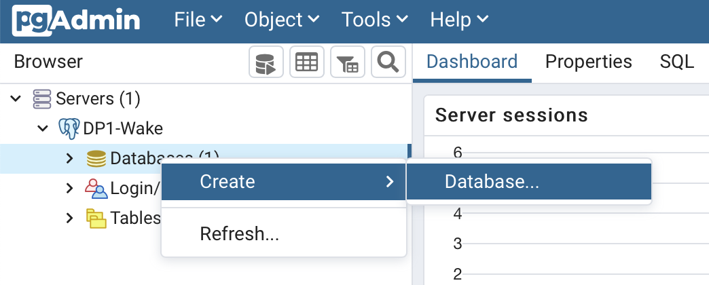
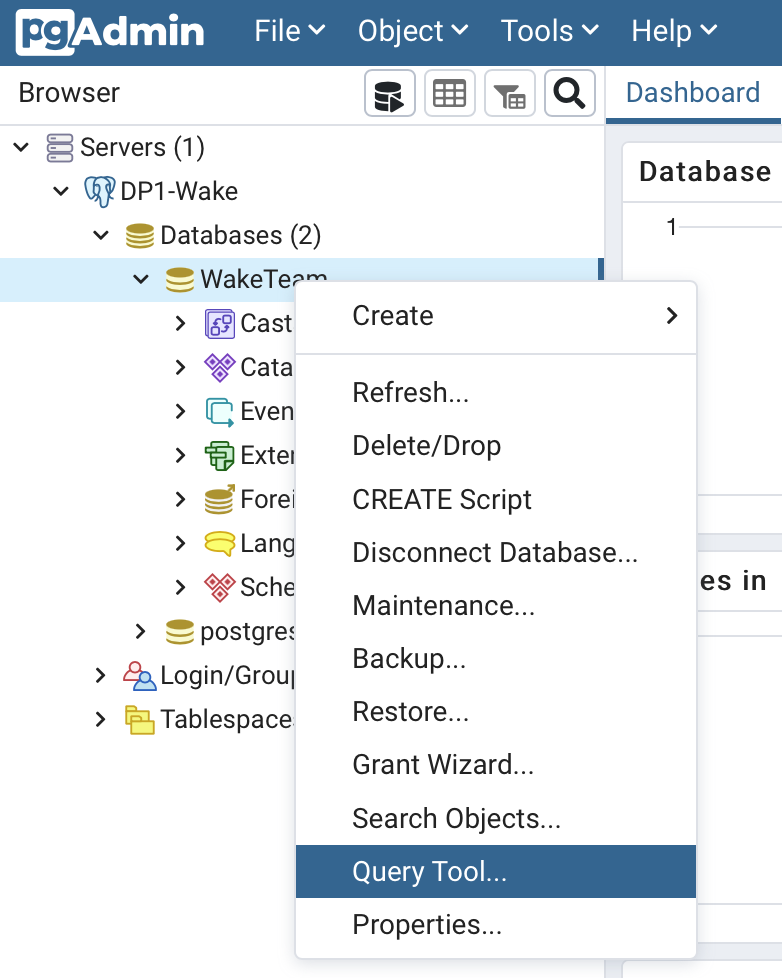
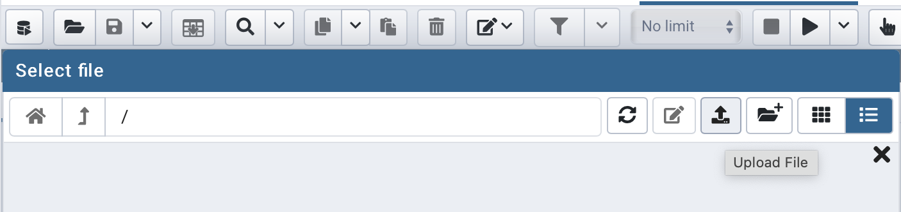
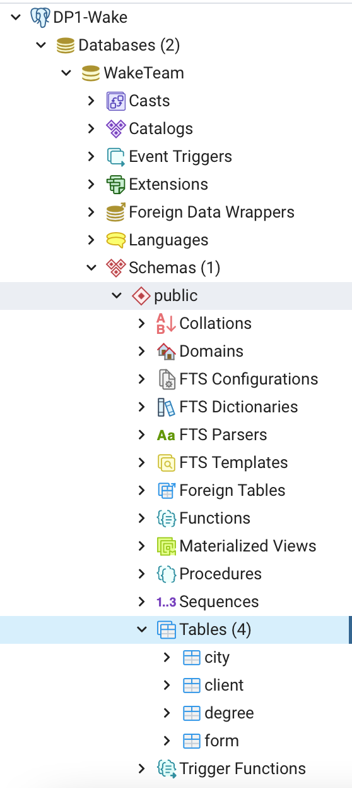

# Data Project 1 - Master Data Analytics EDEM

## Equipo

* [Sofía Zander](https://github.com/sozanmen)
* [Vicente Gil](https://github.com/vicentegilso)
* [Jorge Camáñez](https://github.com/jcamcre)
* [Javier Briones](https://github.com/jabrio)
* [Vicent Asensio](https://github.com/viasmo1)


## Program setup

### Create a VM instance in GCP

1. Enter your [google cloud console](https://console.cloud.google.com)

2. Select the project in which you want to create your VM or create a new one

3. Navigate to COMPUTE -> Compute Engine -> VM Instances

4. Click on CREATE INSTANCE and set up the VM instance with the following configuration:

    * Name: *instance_name*
    * Region and zone: *select the closest one*
    * Machine type: *e2-medium*
    * Boot disk: 
        * OS: *Container Optimized OS*
        * Size: *50GB*
    * Firewall: *Allow HTTP and HTTPS*
    * Networking: *Add network tag* **docker-ports**

### Create a new firewall rule to allow ingress traffic in certain ports

1. In your google cloud console, navigate to NETWORKING -> VPC Networks -> Firewall

2. Click on CREATE FIREWALL RULE and set up the new rule with the following configuration:

    * Name: *rule_name*
    * Direction of traffic: *Ingress*
    * Targets: *Specified target tags*
    * Target tags: **docker-ports**
    * Protocols and ports: *Specified protocols and ports* -> *tcp* -> *5432, 5050, 19999*

### Containers set up

1. Navigate to COMPUTE -> Compute Engine -> VM Instances and click on **SSH** to enter you VM console

**Make an alias to docker-compose** -> [Tutorial](https://cloud.google.com/community/tutorials/docker-compose-on-container-optimized-os)

2. Run the following commands:
```sh
docker run docker/compose:1.27.4
```
```sh
echo alias docker-compose="'"'docker run \
    -v /var/run/docker.sock:/var/run/docker.sock \
    -v "$PWD:$PWD" \
    -w="$PWD" \
    docker/compose:1.27.4'"'" >> ~/.bashrc

source ~/.bashrc
```

**Clone the repo and run the docker-compose**

3. Git clone the following repo: [edem-mda-DP1-wake](https://github.com/viasmo1/edem-mda-DP1-wake)

```sh
git clone https://github.com/viasmo1/edem-mda-DP1-wake
```

4. Navigate to the path where the docker compose file is:
```sh
cd edem-mda-DP1-wake
```

5. Run the following command:
```sh
docker-compose up -d
```

### Access VM services

**Find you external IP address**

* In your GCP consoles, navigate to COMPUTE -> Compute Engine -> VM Instances and click on the *External IP* link

**Components**

| Component | Port | Protocol |
| --- | --- | --- |
| Zeppelin | 19999 | http |
| PgAdmin | 5432 | http |
| Postgres | 5050 | http |
| Nginx | 433 | https |

**Add postgres server and create a new database**

* In your web browser, go to: *external_ip:5050*

    - Credentials:
        - *Email:* waketeam@wake.org
        - *Password:* WakeDP1

* Add a new server with the following configuration:
    - General:
        - *Name:* DP1-Wake
    - Connection:
        - *Host:* postgres
        - *Port:* 5432
        - *Username:* WakeTeam
        - *Password:* WakeDP1

* Create a new database named *WakeTeam*


* Add the database schema:

    * Enter the query tool of the database
    

    * Upload and open the *database_schema.sql* file
    

    * Execute the file. You should now have the tables of the database
    

